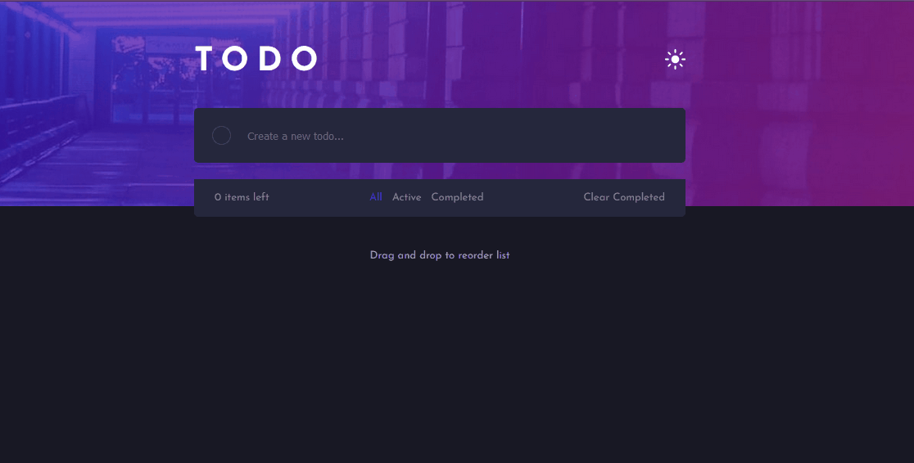

# Frontend Mentor - Todo app solution

Esta é uma solução para o [Todo app challenge on Frontend Mentor](https://www.frontendmentor.io/challenges/todo-app-Su1_KokOW).

## Index

- [Overview](#overview)
  - [O Desafio](#o-desafio)
  - [Screenshot](#screenshot)
  - [Links](#links)
- [Meu processo](#meu-processo)
  - [Feito com](#feito-com)
  - [O que aprendi](#o-que-aprendi)
  - [Desenvolvimento continuo](#desenvolvimento-continuo)
  - [Recursos utilizados](#recursos-utilizados)
- [Autor](#autor)

## Overview

### O Desafio

Usuários devem ser capazes de:

- Ver o design responsivo em diferentes tamanho de telas
- Ver todos os estados ativos de hover
- Adicionar novas tarefas na lista
- Marcar as tarefas como completa
- Deletar tarefas da lista
- Filtrar as tarefas por all/active/completed
- Limpar as tarefas completas
- Trocar o tema entre claro e escuro
- **Bonus**: Drag and drop e reordenar as tarefas na lista

### Screenshot



### Links

- Solution URL: [github](https://github.com/rialbeg/todo-app-react)
- Live Site URL: [Add live site URL here](https://your-live-site-url.com)

## Meu processo

### Feito com

- Semantic HTML5 markup
- Flexbox
- [Styled Components](https://styled-components.com/) - For styles
- typescript
- [React beautiful dnd](https://github.com/atlassian/react-beautiful-dnd) - For drag and drop
- Custom hooks

### O que aprendi

Houve muitos tópicos interessantes neste projeto desde estilo até escrita de algumas funcionalidades.

Um dos principais desafios foi a tipagem com o typescript. Ver a documentação e ficar as mensagens de erro foi fundamental. É bom manter a atenção as mensagens de erro.

Houve tambem alguns tópicos que pareciam simples mas requeriram uma pesquisa mais profunda.

Descobri que aplicar gradiente com radius não tao simples como parece.

```css
.gradient-radius {
  border-radius: 50px;
  border: double 1px transparent;
  background-image: linear-gradient(white, white), linear-gradient(blue, red);
  background-origin: border-box;
  background-clip: content-box, border-box;
}
```

Criar os próprios hooks tem suas vantagens, como por exemplo este hook que retorna a largura da tela.

```ts
import { useEffect, useState } from "react";

export function useWidth() {
  const [width, setWidth] = useState(window.innerWidth);

  useEffect(() => {
    window.addEventListener("resize", () => setWidth(window.innerWidth));
  }, []);

  return width;
}
```

### Desenvolvimento continuo

Daqui em diante o plano é continuar construindo aplicações para me acostumar com o typescript, absorver mais técnicas de estilização e ganhar mais experiência com cenários diferentes.

### Recursos utilizados

- [Gradiente com radius](https://www.youtube.com/watch?v=k-kyiUuRxkQ) - Me ajudou a colocar o efeito de gradiente linear em um círculo.
- [Estilizando Checkbox](https://www.notion.so/todo-app-a20e4fb87c4043b6b4ac749a860d0da8#43846d438a2d403db2748cdcc379082b) - Me ajudou a estilizar o checkbox da tarefa antes e depois do clique.

## Autor

- Website - [Gabriel Mascarenhas](https://rialbeg.github.io/portfolio/)
- Frontend Mentor - [@rialbeg](https://www.frontendmentor.io/profile/rialbeg)
- Linkedin - [@gsamascarenhas](https://www.linkedin.com/in/gsamascarenhas/)
